# Jet Engine Cycle Analysis Tool


A physics-based 1D Brayton cycle simulator demonstrating end-to-end production software practices: a compiled C++ solver orchestrated by Python, built with CMake + Conan, containerized with Docker, and validated by a full CI/CD pipeline on every push.

---

<p align="center"></p>

---

## What this is (and isn't)

This is a **toy problem by design.** The physics are intentionally simplified — calorically perfect gas, fixed TIT, zero bypass ratio, no stage-by-stage turbomachinery — so the focus stays on software engineering quality rather than solver fidelity. The README documents every simplification honestly.

A higher-fidelity version would add variable TIT sweeps, turbofan bypass ratio, real gas properties (NASA-7 polynomials), and oblique shock inlet modeling. A full production solver would couple 1D meanline turbomachinery with CFD for individual components and run a complete mission analysis across climb, cruise, and descent.

---

## Trade study outputs

The tool sweeps OPR (10–40) against Mach (0.5–1.7) at 60,000 ft, producing contour plots of specific thrust (N per kg/s) and SFC (kg/s/N) with a representative Symphony-like operating point marked at OPR ≈ 25, Mach 1.7.

*Plots are generated at runtime and uploaded as CI artifacts on every workflow run.*

---

## Stack

| Layer | Technology |
|---|---|
| Physics solver | C++17, CMake, Conan |
| Orchestration | Python 3.11, subprocess, numpy |
| Visualization | matplotlib |
| Dependency management | Conan (C++), pyproject.toml (Python) |
| Containerization | Docker (multi-stage build) |
| CI/CD | GitHub Actions |
| Documentation | pdoc (auto-generated from docstrings) |

---

## Architecture

Python calls the C++ solver as a subprocess, exchanging JSON on stdin/stdout. This clean interface means the solver can be swapped for a pybind11 shared library by changing a single file (`pipeline/solver_interface.py`) without touching the rest of the stack.

```
scripts/run_trade_study.py
    └── pipeline/trade_study.py          # OPR × Mach grid sweep
        └── pipeline/solver_interface.py # subprocess + JSON protocol
            └── solver/                  # C++ binary (CMake + Conan)
    └── pipeline/plotting.py             # matplotlib contour plots
```

**Solver I/O contract**

Input JSON: `mach`, `opr`, `tit_k`, `altitude_ft`

Output JSON: `specific_thrust_n_per_kgs`, `sfc_kg_per_s_per_n`, `t0_stations_k[6]`, `p0_stations_pa[6]`

Stations follow the diagram above: freestream → inlet exit → compressor exit → combustor exit → turbine exit → nozzle exit.

---

## CI/CD pipeline

Every push triggers a three-stage GitHub Actions workflow:

1. **Build** — Conan installs C++ dependencies, CMake builds and links the solver binary, C++ unit tests run via CTest.
2. **Test** — pytest runs the Python test suite (solver interface, atmosphere model, trade study numerics, regression tests against known outputs).
3. **Trade study** — the full OPR × Mach sweep executes and both contour plots are uploaded as workflow artifacts.

---

## Run with Docker (recommended)

```bash
docker build -f docker/Dockerfile -t engine-analysis .
docker run --rm -v "$(pwd)/outputs:/app/outputs" engine-analysis
```

Plots are written to `outputs/`.

---

## Run natively

**Prerequisites:** Python 3.11+, CMake 3.20+, Conan 2.x, a C++17 compiler.

```bash
# Build the C++ solver
cd solver
conan install . --build=missing -s build_type=Release
cmake -B build -DCMAKE_BUILD_TYPE=Release
cmake --build build

# Install Python dependencies
pip install -e ".[dev]"

# Run trade study
python scripts/run_trade_study.py
```

```bash
# Run tests
pytest tests/
```
